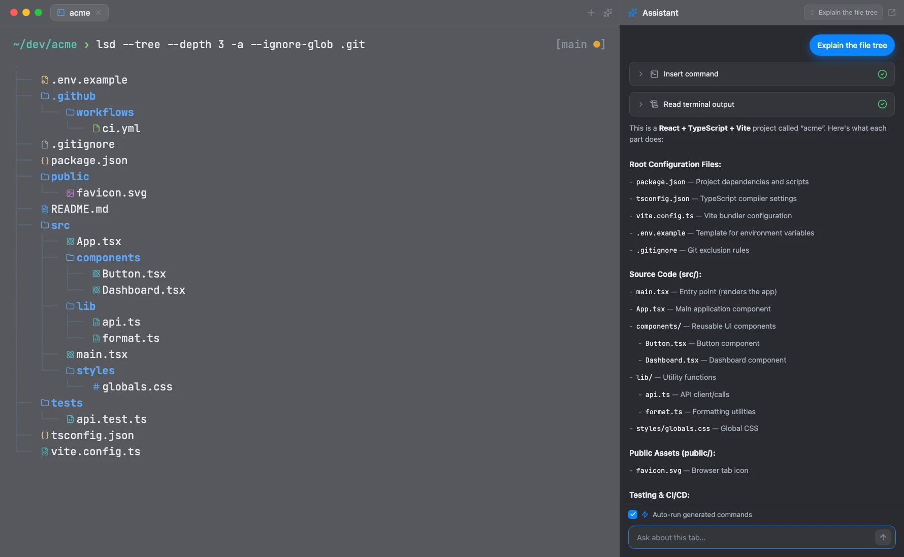
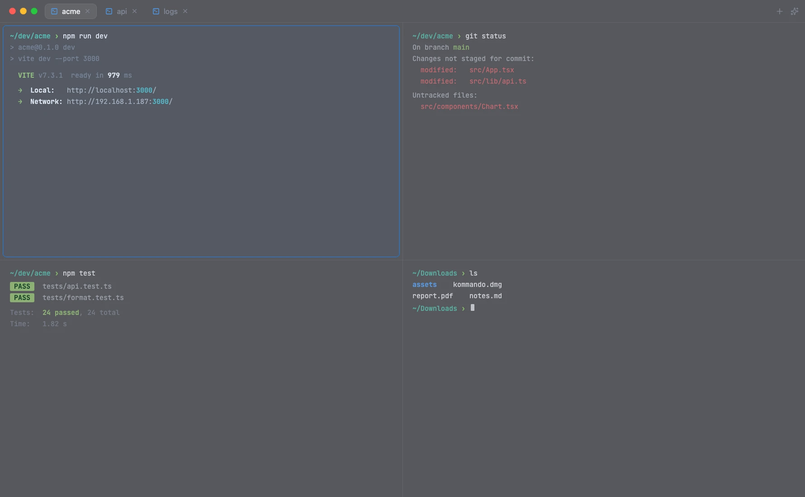

<div align="center">
  
  <h1>Kommando</h1>
  <p><strong>A native macOS terminal — split panes, tabs, and an AI sidebar, built in SwiftUI.</strong></p>
  <p>
    <a href="https://kommando.app"><strong>🌐 kommando.app</strong></a>
    &nbsp;·&nbsp;
    <a href="https://github.com/christianalares/kommando">Source code</a>
  </p>
</div>

<br />

<div align="center">
  <a href="https://kommando.app">
    
  </a>
</div>

---

This repository contains the source for [**kommando.app**](https://kommando.app), the marketing site for
**Kommando**. Kommando is an open-source, native macOS terminal — the app itself lives at
[`christianalares/kommando`](https://github.com/christianalares/kommando).

## Install Kommando

**Homebrew**

```bash
brew install --cask christianalares/tap/kommando
```

**Direct download** — grab `Kommando.zip` from [kommando.app](https://kommando.app), unzip it, and drag
`Kommando.app` to `/Applications`.

Either way you get the same Developer ID-signed, notarized build that keeps itself up to date via Sparkle.
Requires macOS 26 (Tahoe) on Apple silicon.

## Features

- **Split panes** — tile terminals horizontally and vertically; new panes inherit the current directory.
- **Tabs** — a scrollable tab bar with titles that track the focused pane's folder.
- **AI sidebar (BYOK)** — a streaming assistant that reads the focused pane's output and inserts or runs commands. Bring your own Anthropic or OpenAI key, stored in the macOS Keychain.
- **Custom commands & shortcuts** — map your own hotkeys to shell commands and rebind anything.
- **JavaScript REPL** — an optional JS scratchpad with inline JSON inspection of terminal output.
- **Native & private** — built in SwiftUI with session restore, theming, and a translucent window.

<div align="center">
  
</div>

## Built with

The site is built with [TanStack Start](https://tanstack.com/start), [React 19](https://react.dev),
[Tailwind CSS v4](https://tailwindcss.com), and [shadcn/ui](https://ui.shadcn.com), and deployed on
[Cloudflare Workers](https://developers.cloudflare.com/workers/).

## License

© Kommando. All rights reserved.
